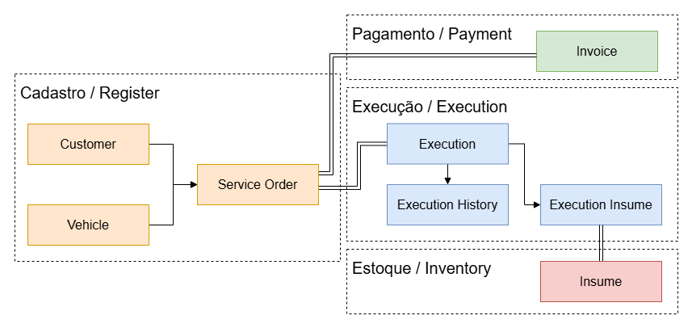
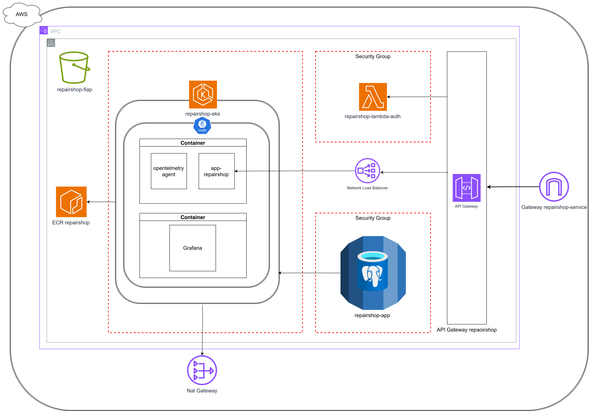
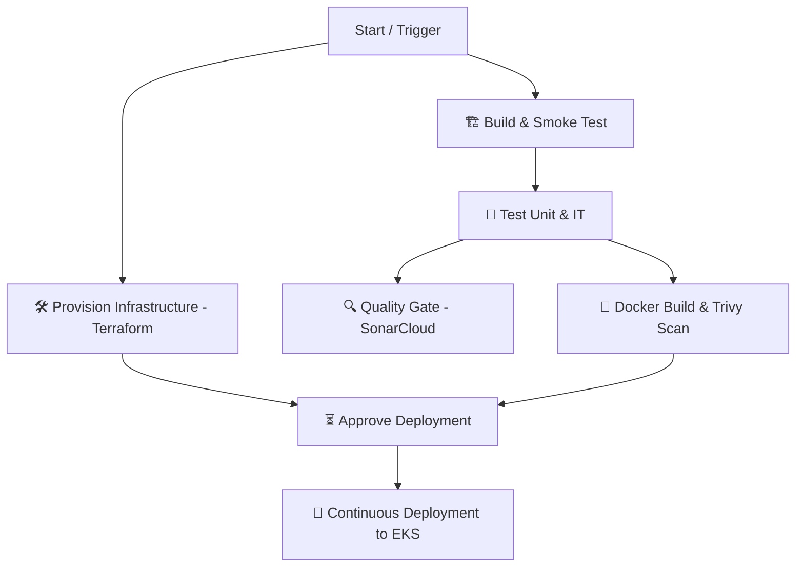
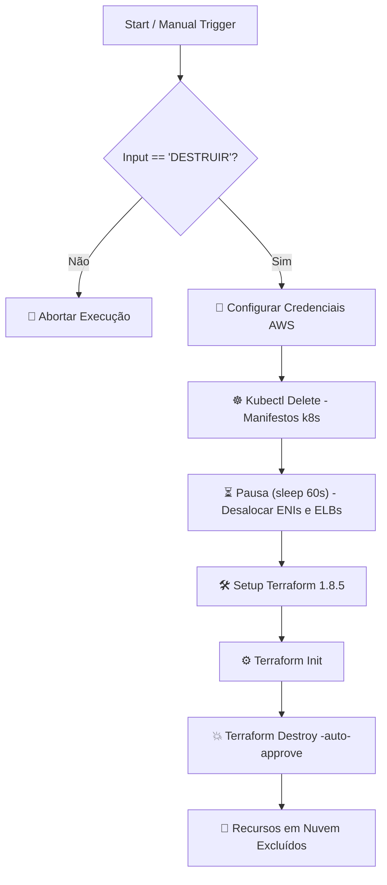
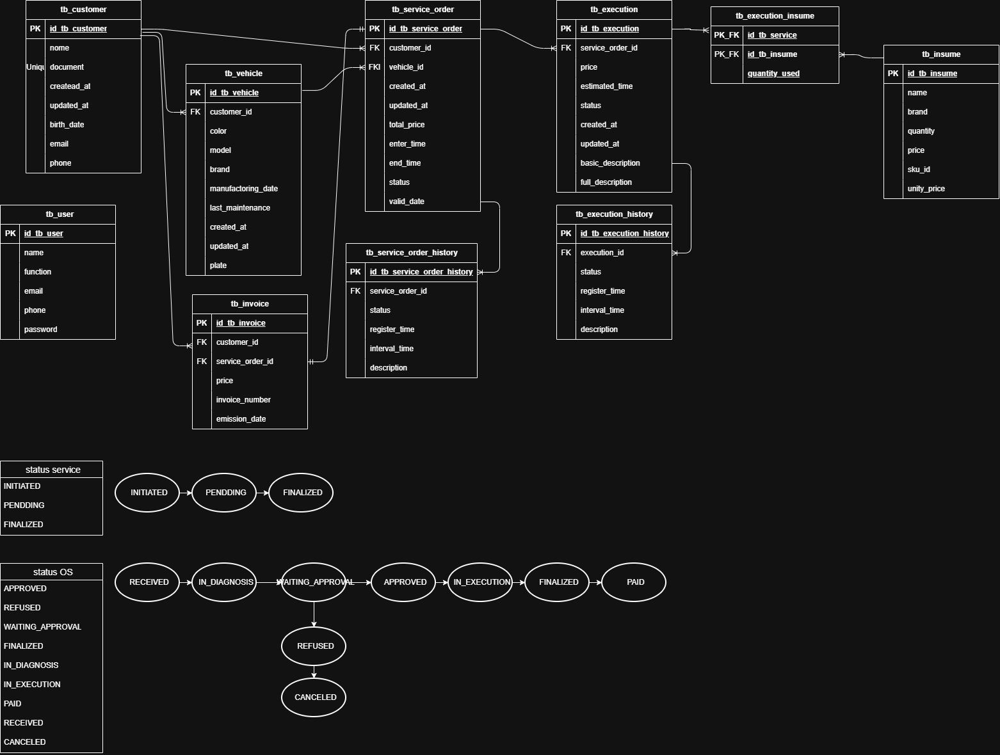
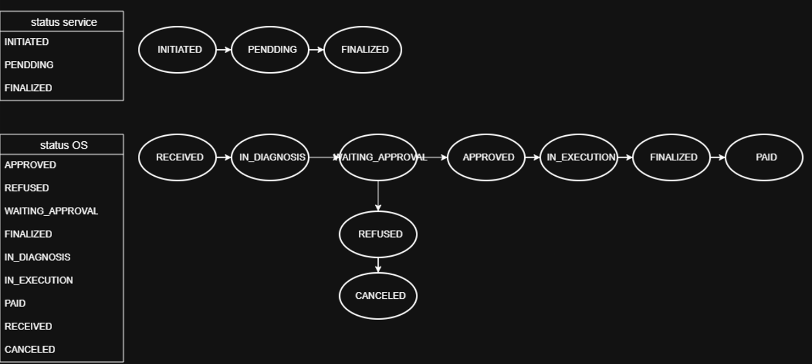

# 🔧 Oficina API

**Sistema Integrado de Atendimento e Execução de Serviços para Oficina Mecânica**

[](https://kotlinlang.org/)
[](https://spring.io/projects/spring-boot)
[](https://www.postgresql.org/)
[](https://www.docker.com/)
[](.)
[](https://sonarcloud.io/summary/new_code?id=repairshop)
[](LICENSE)

*MVP do back-end para gestão de ordens de serviço, clientes, veículos e peças de uma oficina mecânica.*

**POSTECH 15SOAT — Tech Challenge Fase 2 — Grupo CAO**

---

## Sumário

- [Sobre o Projeto](#sobre-o-projeto)
- [Funcionalidades](#funcionalidades)
- [Arquitetura](#arquitetura)
  - [Provisionamento Terraform](#provisionamento-terraform)
  - [Deploy Kubernetes](#deploy-kubernetes)
- [Esteira de Integração e Entrega Contínua (CI/CD)](#esteira-de-integração-e-entrega-contínua-cicd)
  - [Esteira de Destruição da Infraestrutura (Manual)](#esteira-de-destruição-da-infraestrutura-manual)
- [Justificativa do Banco de Dados](#justificativa-do-banco-de-dados)
- [Tecnologias Utilizadas](#tecnologias-utilizadas)
- [Pré-requisitos](#pré-requisitos)
- [Como Executar](#como-executar)
- [Documentação da API](#documentação-da-api)
  - [Máquina de Estados (Status da OS)](#-máquina-de-estados-status-da-os)
  - [Máquina de Estados (Status da Execução de Serviço)](#-máquina-de-estados-status-da-execução-de-serviço)
- [Testes](#testes)
- [Documentação DDD](#documentação-ddd)
- [Segurança](#segurança)
- [Avisos do Projeto](#avisos-do-projeto)
- [Autores](#autores)

---

## Sobre o Projeto

Após a implantação do sistema inicial para gestão da oficina mecânica (Fase 1), houve um ganho significativo de eficiência no atendimento. No entanto, com o aumento da demanda e a expansão para novas unidades, surgiu o desafio de garantir alta disponibilidade e suportar grandes volumes de operações simultâneas em horários de pico. 

O projeto atual, entregue para o **Tech Challenge Fase 2** da pós-graduação **POSTECH 15SOAT**, foca na evolução arquitetural e de infraestrutura da aplicação. O objetivo principal agora transcende as regras de negócio: é garantir que o sistema escale de maneira resiliente, automatizada e sustentável.

### Objetivos da Fase 2

- **Evolução da Infraestrutura:** Reduzir riscos operacionais provendo um ambiente escalável e dinâmico na nuvem.
- **Orquestração e Alta Disponibilidade:** Conteinerizar a aplicação (Docker) e orquestrá-la via **Kubernetes** (EKS), utilizando o *Horizontal Pod Autoscaler (HPA)* para absorver variações de carga.
- **Automação (IaC e CI/CD):** Provisionar toda a estrutura na AWS (VPC, Cluster, RDS, ECR) via **Terraform** e estabelecer uma pipeline completa de CI/CD para automação dos deploys.
- **Qualidade e Refatoração:** Refinar a base de código orientada pela **Clean Architecture** e garantir altíssima cobertura de testes automatizados (unitários e de integração) nos fluxos críticos da aplicação.
- **Evolução do Domínio:** Aprimorar o controle de Ordens de Serviço com filtros refinados, delegação de aprovação de orçamento externa e implementação do envio de notificações por e-mail a cada mudança de status (via Mailpit).

---

## Funcionalidades

- [x] CRUD de Clientes (identificação por CPF/CNPJ)
- [x] CRUD de Veículos (placa, marca, modelo, ano)
- [x] CRUD de Serviços (catálogo de serviços da oficina)
- [x] CRUD de Peças e Insumos com controle de estoque
- [x] Criação de Ordens de Serviço com orçamento automático
- [x] Fluxo de status da OS com transições automáticas
- [x] Consulta de OS pelo cliente para acompanhamento
- [x] Aprovação de orçamento pelo cliente
- [x] Monitoramento do tempo médio de execução dos serviços
- [x] Autenticação e autorização via JWT
- [x] Documentação interativa da API via Swagger/OpenAPI

---

## Arquitetura

O projeto aplica **Domain-Driven Design (DDD)** de forma integral — no nível estratégico (Linguagem Ubíqua, Bounded Contexts) e tático (Entities, Value Objects, Aggregates, Domain Services).



Para suportar o isolamento absoluto das regras de negócio, o código-fonte foi organizado de forma modular por contexto (ex: `customer`, `serviceorder`, `user`) e estruturado internamente utilizando a **Clean Architecture**. Essa abordagem garante que o núcleo da aplicação seja 100% agnóstico a tecnologias externas e frameworks. Cada módulo de domínio é subdividido em três camadas principais:
- **`domain` (Domínio):** O coração do sistema. Contém as `entities` (entidades de negócio puras), lógicas/serviços de domínio centrais e os `mappers`. Não possui e não conhece nenhuma dependência externa.
- **`application` (Aplicação):** Camada de orquestração. Contém os `usecases` (casos de uso) que executam o fluxo de negócio da aplicação. É aqui também que residem as interfaces dos `gateways` (portas de saída), definindo contratos que a infraestrutura deverá cumprir (Inversão de Dependência).
- **`infra` (Infraestrutura):** A camada externa responsável pela I/O e comunicação real. Ela implementa os contratos e expõe o sistema ao mundo. Contém os `controllers` (API REST, rotas e DTOs), a implementação concreta dos `gateways` (ex: integrações externas) e a `persistence` (Modelos do Hibernate e Repositórios do Spring Data JPA ligados ao PostgreSQL).

Isso resulta em um sistema altamente testável, manutenível e fracamente acoplado (onde o ecossistema Spring atua apenas como motor e injeção de dependência na camada `infra`).


### ☸️ Orquestração de Contêineres no Kubernetes (`k8s/`)

Os manifestos Kubernetes da aplicação e observabilidade residem diretamente na raiz de [`k8s/`](k8s/), com as configurações específicas em [`k8s/configs/`](k8s/configs/) e a separação dos ConfigMaps por ambiente em [`k8s/configmap/`](k8s/configmap/):

```
k8s/
├── namespace.yaml              # Namespace 'repairshop'
├── deployment.yaml             # Deployment do Spring Boot com Probes, Recursos e Agente OTel
├── service.yaml                # Service LoadBalancer (Porta 8080)
├── hpa.yaml                    # HPA com escalonamento automático por CPU
├── secret.yaml                 # Secret com credenciais e JWT
├── mailpit.yaml                # Pod e Service do Mailpit para testes de e-mail
├── otel-collector.yaml         # OpenTelemetry Collector Gateway (4317/4318)
├── prometheus.yaml             # Prometheus Server (9090)
├── jaeger.yaml                 # Jaeger Tracing UI (16686)
├── loki.yaml                   # Loki Log Ingestion (3100)
│
├── configs/                    # 📄 Configurações específicas de observabilidade
│   ├── otel-collector-config.yaml
│   ├── prometheus-config.yaml
│   └── loki-config.yaml
│
└── configmap/                  # ⚙️ ConfigMaps separados por ambiente
    ├── configmap-dev.yaml      # ConfigMap DEV (Mailpit ativo, log DEBUG)
    ├── configmap-hml.yaml      # ConfigMap HML (log INFO)
    ├── configmap-prd.yaml      # ConfigMap PRD (SMTP real, log INFO)
    ├── configmap-local.yaml    # ConfigMap Local
    └── postgres-local.yaml     # Pod Postgres para testes locais (Kind / Docker Desktop)
```

> [!NOTE]
> **Infraestrutura em Nuvem Desacoplada (Fase 3):**
> Toda a infraestrutura AWS de nuvem (VPC, RDS PostgreSQL, Cluster EKS, Lambda Auth e API Gateway) é provisionada e gerenciada de forma desacoplada em repositórios dedicados de infraestrutura da organização. Para detalhes de subida e documentação completa, consulte a [Wiki da Organização](https://github.com/fiap-postech-repairshop/tech-challenge-wiki-docs).

#### Como Aplicar os Manifestos no Cluster EKS

1. **Configurar Acesso ao Cluster EKS:**
   ```bash
   aws eks update-kubeconfig --region us-east-1 --name repairshop-eks-dev
   ```

2. **Aplicar as Configurações de Observabilidade e Manifestos Principais:**
   ```bash
   kubectl apply -f k8s/configs/
   kubectl apply -f k8s/
   ```

3. **Aplicar o ConfigMap do Ambiente Desejado (ex: Dev):**
   ```bash
   kubectl apply -f k8s/configmap/configmap-dev.yaml
   ```

4. **Para Execução Local (Kind / Minikube / Docker Desktop):**
   ```bash
   kubectl apply -f k8s/configs/
   kubectl apply -f k8s/
   kubectl apply -f k8s/configmap/configmap-local.yaml
   kubectl apply -f k8s/configmap/postgres-local.yaml
   ```

<div align="center">
  
  <br>
  <em><small><strong>Figura 1: Topologia Integrada (Infraestrutura Cloud e Orquestração Kubernetes)</strong><br>O diagrama ilustra o provisionamento dos recursos na AWS (Rede VPC, Cluster EKS e banco persistente no RDS) atuando em conjunto com a lógica dos manifestos K8s, demonstrando o ciclo de vida dos Pods da aplicação (via Deployments e HPA) e sua integração com serviços auxiliares, como o Mailpit.</small></em>
  <br><br>
</div>

### Deploy Kubernetes

A aplicação é orquestrada via Kubernetes para garantir resiliência e escalabilidade. Os manifestos no diretório `/k8s` incluem:
- **Deployment e Service:** Gerenciam o ciclo de vida dos pods e a exposição da API Spring Boot. Utilizam configurações definidas previamente em Secrets e ConfigMaps.
  - *Arquivos:* [`deployment.yaml`](k8s/deployment.yaml), [`service.yaml`](k8s/service.yaml), [`configmap.yaml`](k8s/configmap.yaml), [`secret.yaml`](k8s/secret.yaml)
- **HPA (Horizontal Pod Autoscaler):** Escala dinamicamente as réplicas da aplicação com base no consumo de recursos, garantindo performance e disponibilidade em picos de acesso.
  - *Arquivo:* [`hpa.yaml`](k8s/hpa.yaml)
- **Mailpit e Gateway:** Deploy isolado para interceptar envios de e-mails das notificações de status, incluindo a configuração de um gateway/service dedicado para acessar a interface web do Mailpit.
  - *Arquivos:* [`mailpit-deployment.yaml`](k8s/mailpit-deployment.yaml), [`mailpit-service.yaml`](k8s/mailpit-service.yaml)
- **Postgres (Local):** Manifestos para implantar o banco de dados caso você esteja rodando em um ambiente local (Docker Desktop), simulando a estrutura sem AWS RDS.
  - *Arquivos:* [`postgres-deployment.yaml`](k8s/local/postgres-deployment.yaml), [`postgres-service.yaml`](k8s/local/postgres-service.yaml)

#### Como Aplicar os Manifestos

Para implantar a aplicação no seu cluster Kubernetes (seja AWS EKS ou cluster local), siga os passos lógicos:

1. **Pré-requisitos e Ambiente:** Para rodar os comandos, você precisa de um ambiente Kubernetes ativo. Se não estiver utilizando o EKS da AWS, certifique-se de ter o **[Docker Desktop](https://www.docker.com/products/docker-desktop/)** instalado com a opção do Kubernetes habilitada. Além disso, é obrigatório ter a ferramenta de linha de comando [`kubectl`](https://kubernetes.io/docs/tasks/tools/) instalada.
   * **Listar contextos conhecidos na máquina:**
     ```bash
     kubectl config get-contexts
     ```
   * **Alternar para o ambiente local (Docker Desktop):**
     ```bash
     kubectl config use-context docker-desktop
     ```
   * **Alternar para o ambiente em nuvem (AWS EKS):**
     Primeiramente, configure/atualize o arquivo `kubeconfig` local associado ao cluster da AWS Academy:
     ```bash
     aws eks update-kubeconfig --region us-east-1 --name repairshop-eks
     ```
     O comando acima já define o contexto do EKS como padrão automaticamente. Caso precise alternar manualmente depois:
     ```bash
     kubectl config use-context arn:aws:eks:us-east-1:<ID_CONTA_AWS>:cluster/repairshop-eks
     ```
   * **Verificar contexto ativo atualmente:**
     ```bash
     kubectl config current-context
     ```
2. **Criar o Namespace:** Crie o isolamento lógico para o projeto (`repairshop`):
   ```bash
   kubectl apply -f k8s/namespace.yaml
   ```

A partir daqui, escolha o fluxo de deploy de acordo com o seu ambiente:

### Deploy Local (Desenvolvimento)
Este cenário utiliza o **Kustomize** para injetar as credenciais locais do banco de dados PostgreSQL e substituir a imagem do ECR de produção por uma imagem buildada localmente (`repairshop:local`).

1. **Buildar a imagem local da aplicação:**
   No diretório raiz do projeto, execute o comando de build especificando a tag `local`:
   ```bash
   docker build -t repairshop:local .
   ```

2. **Deploy Integrado via Kustomize:**
   Execute o Kustomize para aplicar de forma ordenada todo o ambiente (Postgres local, variáveis de ambiente locais, aplicação local, Service, HPA e Mailpit):
   ```bash
   kubectl kustomize k8s/local/ --load-restrictor LoadRestrictionsNone | kubectl apply -f -
   ```

---

### Deploy na Nuvem (AWS EKS)

> [!IMPORTANT]
> **Pré-requisito:** Antes de realizar qualquer deploy na nuvem (seja automático ou manual), certifique-se de ter executado o provisionamento de toda a infraestrutura da AWS via Terraform (passo a passo detalhado na seção anterior [Como Aplicar a Infraestrutura](#como-aplicar-a-infraestrutura)).

Para realizar o deploy manual no EKS a partir de sua máquina de forma dinâmica (sem a necessidade de editar arquivos manualmente), certifique-se de **estar no diretório raiz do projeto** (caso esteja no diretório do Terraform, retorne executando `cd ../../..`). Utilize os comandos abaixo no terminal (PowerShell):

1. **Autenticar e Enviar a Imagem para o ECR:**
   ```powershell
   # 1. Obtém o Account ID automaticamente do AWS CLI
   $accountId = (aws sts get-caller-identity --query Account --output text)

   # 2. Obtém a senha do ECR e realiza o login (evita bug de encoding do pipe no PowerShell)
   $password = (aws ecr get-login-password --region us-east-1)
   docker login --username AWS --password $password "${accountId}.dkr.ecr.us-east-1.amazonaws.com"

   # 3. Builda a imagem da aplicação (especificando o caminho do Dockerfile)
   docker build -t repairshop:latest -f ./Dockerfile .

   # 4. Taggea e envia a imagem para o seu repositório ECR
   docker tag repairshop:latest "${accountId}.dkr.ecr.us-east-1.amazonaws.com/repairshop:latest"
   docker push "${accountId}.dkr.ecr.us-east-1.amazonaws.com/repairshop:latest"
   ```

2. **Aplicar os manifestos no EKS com substituição dinâmica:**

   Conecte-se ao contexto do cluster e crie o namespace:
   ```bash
   # Conectar ao cluster EKS da AWS
   aws eks update-kubeconfig --region us-east-1 --name repairshop-eks

   # Criar o Namespace (se ainda não existir no cluster)
   kubectl apply -f k8s/namespace.yaml
   ```

   Execute o deploy aplicando a substituição do ID de conta AWS dinamicamente em memória:
   ```powershell
   $accountId = (aws sts get-caller-identity --query Account --output text)
   (kubectl kustomize k8s/aws/ --load-restrictor LoadRestrictionsNone) -replace '<SUA_CONTA_AWS>', $accountId | kubectl apply -f -
   ```

---

### Monitorar o Status
Acompanhe os pods do namespace até que fiquem no status `Running`:
```bash
kubectl get pods -n repairshop
```


---

## Esteira de Integração e Entrega Contínua (CI/CD)

A esteira de CI/CD foi automatizada com o **GitHub Actions** (através do arquivo de workflow [`.github/workflows/ci.yml`](.github/workflows/ci.yml)), integrando todos os processos de compilação, testes, qualidade de código, segurança e deploy de forma automatizada e resiliente para atender aos requisitos da Fase 2.

### Fluxo da Pipeline (GitHub Actions)

A pipeline é disparada a cada `push` ou `pull_request` nas branches `main` e `develop`. 

> [!IMPORTANT]
> **Paralelismo e Regras de Execução:**
> - O provisionamento da infraestrutura com **Terraform** roda em **paralelo (junto)** com o estágio de **Build da Aplicação** para otimizar o tempo total da pipeline.
> - O deploy/aplicação de infraestrutura (`terraform apply`) ocorre **apenas em merges ou pushes diretos nas branches principais (`main` e `develop`)**, sendo **totalmente ignorado em Pull Requests (PR)** para garantir a estabilidade do ambiente.

A pipeline possui uma arquitetura dividida em estágios complementares:



### Detalhamento dos Estágios

Conforme exigido nas diretrizes do Tech Challenge (Fase 2), a pipeline executa:

1. **Build da Aplicação:**
   - Compilação e empacotamento da aplicação Kotlin / Spring Boot via Maven.
   - **Smoke Test pós-Build:** Sobe temporariamente as dependências (Postgres e Mailpit) e roda o JAR compilado, verificando a inicialização da aplicação através do endpoint `/actuator/health`.
2. **Deploy da Infraestrutura (Terraform):**
   - Executado em **paralelo (junto)** com o estágio de **Build da Aplicação** (Stage 0).
   - O provisionamento/deploy (comando `terraform apply`) **roda apenas quando há um merge ou push direto nas branches principais (`main` e `develop`)**, sendo **totalmente ignorado (pulado) em execuções de Pull Request (PR)** para evitar modificações indesejadas na infraestrutura antes da aprovação do PR.
3. **Execução dos Testes Automatizados:**
   - Execução de todos os testes unitários e de integração utilizando **Testcontainers** (para subir o banco PostgreSQL real de teste).
   - Coleta de métricas e geração de relatório de cobertura de código via **JaCoCo**.
4. **Quality Gate (Análise de Código):**
   - Roda a verificação de qualidade estática no **SonarCloud**, validando o Quality Gate do projeto e enviando os dados de cobertura gerados pelo JaCoCo (garantindo que esteja acima de 80%).

> [!NOTE]
> A atualização de status do Quality Gate consolidado no painel do SonarCloud é limitada à branch `main`, garantindo que as métricas de qualidade do projeto reflitam apenas o código de produção estável.

5. **Build da Imagem Docker & Trivy Scan:**
   - Criação da imagem Docker baseada no `Dockerfile` multi-stage com a JRE do Java 24 (`eclipse-temurin:24-jre`).
   - Escaneamento de vulnerabilidades com a ferramenta **Trivy** (focando em falhas graves/criticas).
   - **Smoke Test do Container:** Inicia o container gerado da aplicação para validar se está respondendo perfeitamente na porta HTTP 8080 antes de realizar qualquer publicação.
   - Publicação/Push automático da imagem Docker no **Amazon ECR** (registro privado AWS).

> [!NOTE]
> O envio da imagem (comando `docker push`) é executado **exclusivamente após merges ou pushes diretos nas branches principais (`main` e `develop`)**. Em execuções de Pull Request (PR), o build, o Trivy scan e o Smoke Test são executados normalmente para validação técnica, mas a imagem final **não** é publicada no ECR.

6. **Aprovação Manual:**
   - **Quando é utilizado**: Este estágio é ativado **exclusivamente nas execuções das branches principais (`main` e `develop`)**. Ele **depende diretamente da conclusão bem-sucedida do build/push da imagem Docker (Docker Build & Push) E do provisionamento de infraestrutura (Terraform)** para ser acionado. Uma vez ativado, ele cria automaticamente uma issue de aprovação manual no repositório do GitHub e aguarda uma confirmação explícita do operador para prosseguir com o deploy.
   - **Quando é ignorado**: É **totalmente ignorado (pulado) em execuções originadas de Pull Request (PR)**, já que o deploy de novas versões só deve ser elegível após a aprovação e mesclagem das alterações.
7. **Deploy no Cluster Kubernetes (EKS):**
   - Configuração dinâmica das credenciais do Kubernetes usando o AWS CLI.
   - Substituição de variáveis confidenciais (secrets como string de conexão do banco no RDS AWS) e aplicação automatizada dos manifestos (`kubectl apply -f k8s/`) no cluster EKS.
   - Monitoramento do progresso (`kubectl rollout status`) para garantir que os novos pods estejam operantes.

### Secrets e Variáveis de Ambiente Requeridos

Para que a esteira de CI/CD seja executada com sucesso e consiga provisionar os recursos na AWS e realizar o deploy no EKS, as seguintes chaves secretas (**Secrets**) devem estar configuradas nas configurações do repositório no GitHub:

| Secret Name | Estágio Utilizado | Finalidade | Obrigatório |
|-------------|-------------------|------------|-------------|
| `AWS_ACCESS_KEY_ID` | Terraform, ECR, EKS | ID da Chave de Acesso para autenticação de comandos AWS (IaC e deploy) | Sim |
| `AWS_SECRET_ACCESS_KEY` | Terraform, ECR, EKS | Chave Secreta de Acesso AWS para autenticação | Sim |
| `AWS_SESSION_TOKEN` | Terraform, ECR, EKS | Token de sessão temporária (exigido caso utilize credenciais dinâmicas do AWS Academy/Sandbox) | Opcional |
| `SPRING_DATASOURCE_USERNAME` | Terraform, Smoke Test, EKS | Nome de usuário do banco PostgreSQL (utilizado no provisionamento RDS e injetado no cluster EKS) | Sim |
| `SPRING_DATASOURCE_PASSWORD` | Terraform, Smoke Test, EKS | Senha de acesso do banco PostgreSQL (utilizado no provisionamento RDS e injetado no cluster EKS) | Sim |
| `SPRING_DATASOURCE_URL` | Smoke Test | String de conexão JDBC para testes de integridade local durante a pipeline | Sim |
| `SPRING_MAIL_HOST` | Smoke Test | Endereço do host do servidor SMTP para validação de disparo de e-mails nos testes (ex: `mailpit`) | Sim |
| `SPRING_MAIL_PORT` | Smoke Test | Porta do servidor SMTP (ex: `1025`) | Sim |
| `SONAR_TOKEN` | Quality Gate | Token de autenticação do **SonarCloud** para a análise estática e Quality Gate | Sim |

> [!NOTE]
> **Substituições Automáticas durante o Deploy:**
> - O identificador da conta AWS (`ACCOUNT_ID`) é obtido dinamicamente no pipeline via AWS CLI para mapear a URL do ECR (`*.dkr.ecr.us-east-1.amazonaws.com`) e substituir o placeholder `ECR_REGISTRY` no `k8s/deployment.yaml`.
> - Os placeholders `DB_USERNAME` e `DB_PASSWORD` localizados no manifesto [`k8s/secret.yaml`](k8s/secret.yaml) são substituídos dinamicamente em tempo de execução na esteira com os valores de `SPRING_DATASOURCE_USERNAME` e `SPRING_DATASOURCE_PASSWORD`, respectivamente.

### Esteira de Destruição da Infraestrutura (Manual)

Além do pipeline principal de implantação, foi estruturado um workflow manual dedicado para a remoção segura de todos os recursos provisionados na nuvem: o **Destroy Cloud Infrastructure** (localizado em [`.github/workflows/destroy.yml`](.github/workflows/destroy.yml)).

Este workflow é acionado via **gatilho manual (`workflow_dispatch`)** no console de Actions do GitHub e possui as seguintes diretrizes e etapas:

1. **Validação de Segurança (Input Exigido):**
   - Para evitar acidentes operacionais, a esteira exige que o usuário digite literalmente a palavra **`DESTRUIR`** (em caixa alta) no parâmetro de entrada (`confirm_destroy`).
   - Qualquer valor diferente (incluindo o padrão `NAO`) causará o aborto imediato do processo sem afetar nenhum recurso em nuvem.
2. **Desativação Limpa do Kubernetes (Kubectl Clean):**
   - Configura a autenticação de rede com o cluster EKS da AWS.
   - Executa `kubectl delete -f k8s/` para desmontar de forma ordenada a aplicação e os seus serviços.
   - Realiza uma **pausa programada de 60 segundos (`sleep 60`)**. Esse intervalo é vital para dar tempo de desassociar e desalocar as interfaces de rede dinâmicas (**ENIs**) e os **Load Balancers (ELBs)** da AWS integrados às subnets. Sem esse intervalo, o Terraform falharia na tentativa de apagar a rede VPC por ter dependências de rede ainda vinculadas a IPs ativos.
3. **Desprovisionamento Cloud via Terraform:**
   - Configura a versão correta do CLI do Terraform (`1.8.5`).
   - Inicializa o diretório e executa o comando `terraform destroy -auto-approve` na pasta `infra/terraform/cloud` para remover de forma integral os bancos RDS PostgreSQL, clusters EKS, buckets S3, subnets, gateways e VPC, prevenindo qualquer cobrança de recursos órfãos na nuvem.

> [!WARNING]
> **Necessidade de Credenciais AWS Ativas:**
> Antes de acionar esta esteira (assim como a de deploy), certifique-se de que os segredos de credenciais da AWS (`AWS_ACCESS_KEY_ID`, `AWS_SECRET_ACCESS_KEY` e, se estiver rodando em laboratórios/sandboxes acadêmicos da AWS Academy, o `AWS_SESSION_TOKEN`) estejam **atualizados e válidos** nas configurações de Secrets do repositório. Credenciais expiradas farão com que a desativação de recursos no Kubernetes e o desprovisionamento no Terraform falhem no meio da execução.

#### Fluxo da Pipeline de Destruição (Manual)

O fluxo da esteira manual de exclusão de recursos segue as seguintes etapas integradas:



---

## Justificativa do Banco de Dados

Optamos pelo **PostgreSQL** pelos seguintes motivos:

| Critério | Justificativa |
|----------|--------------|
| **Integridade relacional** | O domínio possui relações claras entre clientes, veículos, ordens de serviço, serviços e peças — um modelo relacional garante consistência via foreign keys e constraints |
| **Conformidade ACID** | Ordens de serviço envolvem transações com múltiplas entidades (serviços, peças, estoque) que precisam de atomicidade e consistência |
| **Controle de estoque** | Operações concorrentes de baixa de peças exigem isolamento transacional robusto |
| **Ecossistema** | Integração madura com Spring Data JPA/Hibernate |
| **Open source** | Sem custos de licenciamento, com comunidade ativa e documentação extensa |

<div align="center">
  
  <br>
  <em><small><strong>Figura 2: Diagrama de Entidade e Relacionamento (ERD)</strong><br>O modelo ilustra as principais tabelas do domínio (Clientes, Veículos, OS, Serviços, Peças) mapeadas via JPA, com foco em integridade referencial e controle transacional para o sistema da oficina.</small></em>
  <br><br>
</div>

---

## Tecnologias Utilizadas

| Tecnologia                  | Finalidade                                 |
|-----------------------------|--------------------------------------------|
| **Kotlin**                  | Linguagem principal                        |
| **Spring Boot**             | Framework para construção da API REST      |
| **Spring Security**         | Autenticação e autorização com JWT         |
| **Spring Data JPA**         | Acesso a dados                             |
| **PostgreSQL**              | Banco de dados relacional                  |
| **Flyway**                  | Gerenciamento de migrations                |
| **Docker / Docker Compose** | Containerização e orquestração do ambiente |

---

## Pré-requisitos

- [Docker Desktop](https://www.docker.com/products/docker-desktop/) (com Docker Engine e Docker Compose integrados e em execução)
- **Java 24** (Obrigatório apenas caso deseje rodar a aplicação ou os testes localmente sem o Docker)

---

## Como Executar

O projeto utiliza um `Dockerfile` *multi-stage*, o que significa que a imagem Docker baixa o Maven e compila o `.jar` internamente. Portanto, ter o Maven ou o Java instalados na sua máquina **não é estritamente obrigatório** apenas para rodar a aplicação via Docker.

No entanto, o fluxo padrão recomendado para desenvolvedores é compilar e validar os testes localmente antes de subir a imagem:

```bash
# 1. Clone o repositório
git clone https://github.com/Alexandre-AGAMIN/tech-challenge-FIAP.git
cd tech-challenge-FIAP

# 2. (Opcional) Faça o build e rode os testes locais usando o Maven Wrapper
./.mvn/mvnw clean install

# 3. Suba a infraestrutura completa via Docker
docker compose up --build -d

# 4. Aguarde os logs indicarem que a aplicação subiu
docker compose logs -f app
# Procure pela mensagem: "Started RepairshopApplication"
```

O `docker-compose.yml` provisiona a aplicação juntamente com a **stack completa de observabilidade e suporte**:

| Serviço | Porta | Descrição |
|---------|-------|-----------|
| `postgres` | 5432 | PostgreSQL 16 com healthcheck |
| `app` | 8080 | Aplicação Spring Boot instrumentada com OpenTelemetry Agent |
| `mailpit` | 8025 / 1025 | Interceptador de e-mails locais (Dashboard web em 8025) |
| `otel-collector` | 4317 / 4318 / 8889 | OpenTelemetry Collector (recebe OTLP e distribui traces, métricas e logs) |
| `prometheus` | 9090 | Prometheus (coleta métricas do OTel Collector e Actuator) |
| `jaeger` | 16686 | Jaeger UI (Distributed Tracing OTLP) |
| `loki` | 3100 | Grafana Loki (Agregação de logs estruturados) |
| `grafana` | 3000 | Grafana com Dashboards e Datasources (Prometheus, Jaeger, Loki) provisionados |
| `sonarqube` | 9000 | Plataforma de análise contínua de qualidade de código |

> Na primeira execução, o **Flyway** da aplicação aplica automaticamente todas as migrations no banco de dados (criação de tabelas, indexes e seed de insumos).

### 🌐 Acessos e Painéis

Com os containers rodando, as interfaces estão disponíveis nos seguintes endereços:

| Recurso | URL | Credenciais Padrão |
|---------|-----|--------------------|
| Swagger UI (Recomendado) | http://localhost:8080/swagger-ui/index.html | - |
| API REST (Base) | http://localhost:8080 | - |
| **Grafana (Observabilidade)** | http://localhost:3000 | `admin` / `admin` (Anonymous auto-login ativo) |
| **Jaeger Tracing** | http://localhost:16686 | - |
| **Prometheus UI** | http://localhost:9090 | - |
| Caixa de E-mails (Mailpit) | http://localhost:8025 | - |
| Dashboard SonarQube | http://localhost:9000 | `admin` / `admin` |

### 🚀 Primeiro uso (Via Swagger UI ou Postman)

A grande maioria dos endpoints exige autenticação JWT. Recomendamos realizar o primeiro uso diretamente pelo **Swagger UI** (`http://localhost:8080/swagger-ui/index.html`) para evitar problemas de formatação de JSON no terminal do Windows (como no caso do `curl`):

> 💡 **Dica para o Postman:** Utilize a collection disponível no diretório [`docs/postman/`](docs/postman/)
> 
> Uma coleção organizada com um fluxo lógico de negócio para facilitar a validação do desafio.
>   - Cadastro => Login => OS => Execução => Pagamento

[Ambiente Local](docs/postman/Local.postman_environment.json)

[Collection do Postman](docs/postman/Tech_Challenge_Fiap_-_Completo.postman_collection.json)

1. Vá até o endpoint `POST /auth/register` no Swagger e cadastre o usuário inicial:
   ```json
   {
     "name": "Admin",
     "function": "ATTENDANT", // Roles aceitas: CUSTOMER ou ATTENDANT
     "email": "admin@shop.com",
     "password": "SecurePass123"
   }
   ```
2. Vá até `POST /auth/login`, envie o e-mail e senha cadastrados para receber o token JWT.
3. Copie o valor do `token` (sem aspas) da resposta.
4. Clique no botão **Authorize** (cadeado verde no topo do Swagger) e cole o token. A partir de agora, o Swagger injetará o header `Authorization: Bearer <token>` em todas as suas requisições automaticamente!

### 🛠️ Comandos úteis

```bash
# Rodar análise de código local e enviar pro SonarQube container (requer Java 24)
mvn clean verify org.sonarsource.scanner.maven:sonar-maven-plugin:sonar -Dsonar.projectKey=repairshop -Dsonar.projectName='repairshop' -Dsonar.host.url=http://localhost:9000 -Dsonar.token=<SONAR_TOKEN>

# Parar os containers (mantém os dados)
docker compose down

# Parar e resetar tudo (remove o banco de dados e as análises do sonar)
docker compose down -v
```

---

## Documentação da API

A API é documentada via **OpenAPI 3.0** e pode ser acessada interativamente pelo **Swagger UI**:

```
http://localhost:8080/swagger-ui.html
```

### Principais Endpoints

| Domínio | Método | Endpoint | Descrição |
|---------|--------|----------|-----------|
| **Auth** | `POST` | `/auth/login` | Autenticação e geração de token JWT |
| | `POST` | `/auth/register` | Registrar novo usuário |
| **Customers** | `POST` | `/customers` | Cadastrar cliente |
| | `GET` | `/customers` | Listar clientes (paginado) |
| | `GET` | `/customers/{id}` | Buscar cliente por ID |
| | `PUT` | `/customers/{id}` | Atualizar cliente |
| | `DELETE` | `/customers/{id}` | Remover cliente |
| **Vehicles** | `POST` | `/vehicles` | Cadastrar veículo |
| | `GET` | `/vehicles` | Listar veículos (paginado) |
| | `GET` | `/vehicles/{id}` | Buscar veículo por ID |
| | `PUT` | `/vehicles/{id}` | Atualizar veículo |
| | `DELETE` | `/vehicles/{id}` | Remover veículo |
| **Insumes** | `POST` | `/insumes` | Cadastrar insumo/peça |
| | `GET` | `/insumes` | Listar insumos (paginado) |
| | `GET` | `/insumes/{id}` | Buscar insumo por ID |
| | `PUT` | `/insumes/{id}` | Atualizar insumo |
| | `DELETE` | `/insumes/{id}` | Remover insumo |
| **Service Orders** | `POST` | `/service-orders` | Criar OS com orçamento automático |
| | `GET` | `/service-orders` | Listar ordens de serviço (paginado) |
| | `GET` | `/service-orders/{id}` | Consultar OS (público, sem auth) |
| | `PATCH` | `/service-orders/{id}/status` | Avançar status da OS |
| | `POST` | `/service-orders/{id}/approve` | Aprovar/recusar orçamento |
| | `GET` | `/service-orders/metrics` | Métricas gerais das ordens de serviço |
| | `GET` | `/service-orders/executions/metrics`| Métricas de tempo de execução |
| **Executions** | `POST` | `/service-orders/{id}/executions` | Adicionar serviço/execução à OS |
| | `POST` | `/service-orders/{id}/executions/batch` | Adicionar múltiplos serviços à OS |
| | `GET` | `/service-orders/{id}/executions/{execId}` | Buscar execução de serviço na OS |
| | `PUT` | `/service-orders/{id}/executions/{execId}` | Atualizar execução |
| | `PATCH` | `/service-orders/{id}/executions/{execId}/status`| Avançar status da execução |
| | `DELETE` | `/service-orders/{id}/executions/{execId}` | Remover execução da OS |
| **Invoices** | `POST` | `/invoices` | Gerar fatura para pagamento |
| | `GET` | `/invoices` | Listar faturas (paginado) |
| | `GET` | `/invoices/{id}` | Consultar fatura por ID |

#### Valores Úteis: Descrições de Execução (`BasicExecution`)
Ao adicionar execuções (serviços) à uma OS (`POST /service-orders/{id}/executions`), o campo `basicDescription` deve conter um dos seguintes valores padronizados:
- `OIL_CHANGE`
- `SUSPENSION_REPLACEMENT`
- `WHEEL_ALIGNMENT`
- `BRAKE_INSPECTION`
- `ENGINE_DIAGNOSIS`
- `OTHER`

### ⚙️ Máquina de Estados (Status da OS)

O fluxo de atendimento da Ordem de Serviço segue um controle de status rigoroso. Você pode avançar o status chamando o endpoint `PATCH /service-orders/{id}/status`. As transições sequenciais permitidas são:

1. `RECEIVED` ➡️ `IN_DIAGNOSIS`
2. `IN_DIAGNOSIS` ➡️ `WAITING_APPROVAL`
3. `WAITING_APPROVAL` ➡️ `APPROVED` ou `REFUSED`
   - ⚠️ **Atenção:** A transição a partir de `WAITING_APPROVAL` **não pode** ser feita pelo `PATCH`. É obrigatório chamar o endpoint específico `POST /service-orders/{id}/approve`, enviando a decisão do cliente.
4. `APPROVED` ➡️ `IN_EXECUTION`
5. `REFUSED` ➡️ `CANCELED`
6. `IN_EXECUTION` ➡️ `FINALIZED`
7. `FINALIZED` ➡️ `PAID`
   - ⚠️ **Atenção:** Para que a OS avance para `PAID`, é necessário faturá-la chamando a API de Invoices (`POST /invoices`) para criar a nota fiscal.

<div align="center">
  
  <br>
  <em><small><strong>Figura 3: Máquina de Estados (Ordem de Serviço)</strong><br>O fluxo visualiza a transição de ciclo de vida de uma OS, passando por aprovação do cliente até a sua execução, faturamento (invoices) e pagamento final. Transições indevidas são bloqueadas na camada de aplicação.</small></em>
  <br><br>
</div>

### 🛠️ Máquina de Estados (Status da Execução de Serviço)

Cada serviço individual dentro de uma Ordem de Serviço possui seu próprio controle de progresso. Você pode avançar o status de uma execução específica chamando o endpoint `PATCH /service-orders/{id}/executions/{execId}/status`.

As transições permitidas são:
1. `INITIATED` ➡️ `PENDING`
2. `PENDING` ➡️ `FINALIZED`

---

## Testes

**118 testes** (unitários + integração), todos passando:

```bash
# Rodar os testes (sem necessidade de banco — usam MockK)
./mvnw test
```

| Camada | Testes | O que cobre |
|--------|--------|-------------|
| Value Objects & Enums | 32 | CPF/CNPJ, placa, status OS (9 estados), status serviço |
| Services (MockK) | 54 | CRUD, state machine, stock, budget, auth |
| Controllers (MockMvc) | 32 | Endpoints, validação, erros, paginação |

Cobertura de **80%+** nos domínios críticos (transições de status, cálculo de orçamento, dedução de estoque, validações de CPF/CNPJ/placa).

> 📊 Os relatórios de análise de qualidade de código e cobertura gerados pelo **SonarQube** estão disponíveis na pasta [`docs/sonar/`](docs/sonar/).

---

## Documentação DDD

A documentação de Domain-Driven Design do projeto inclui:

- **Event Storming** — Fluxos de criação/acompanhamento da OS e gestão de peças/insumos
- **Linguagem Ubíqua** — Glossário de termos do domínio
- **Diagramas** — Bounded Contexts, Aggregates e fluxos de domínio

> 📄 O **Dicionário de Linguagem Ubíqua** está disponível em [`docs/delivery/dicionario-linguagem-ubiqua.md`](docs/delivery/dicionario-linguagem-ubiqua.md).
> 
> 🗺️ Os quadros do **Miro** (Event Storming e Storytelling) exportados em PDF estão na pasta [`docs/delivery/miro/`](docs/delivery/miro/) ou você pode acessar também através do link [Miro](https://miro.com/app/board/uXjVGpcPYDY=/?share_link_id=818382063586).

---

## Segurança

| Aspecto | Implementação |
|---------|--------------|
| **Autenticação** | JWT (JSON Web Tokens) para APIs administrativas |
| **Validação** | Dados sensíveis validados (CPF/CNPJ, placa de veículo) |
| **Testes** | Unitários e de integração para os principais fluxos |

> 🛡️ O relatório de escaneamento de vulnerabilidades gerado pelo **OWASP ZAP** está disponível na pasta [`docs/owaspzap/`](docs/owaspzap/).

---

## Avisos do Projeto

### Endpoint `/register` (Autenticação)

O serviço `/register` (disponível na API de autenticação) existe **apenas para fins didáticos e de demonstração** no escopo deste projeto acadêmico (Tech Challenge). 

Em um cenário de produção real, o cadastro de novos usuários administradores/funcionários do sistema não seria exposto em um endpoint de uso aberto. A criação de usuários seria feita de forma controlada, através de um painel administrativo com os devidos controles de acesso, ou por um processo interno de provisionamento.

### Workflow de Destruição (`destroy.yml`)

O workflow automatizado de destruição de infraestrutura ([`destroy.yml`](.github/workflows/destroy.yml)) foi disponibilizado neste repositório **apenas por se tratar de um projeto acadêmico e de estudo**, visando facilitar a limpeza e evitar custos desnecessários com recursos de nuvem ativos.

Em uma aplicação real corporativa, pipelines ou scripts com a capacidade de destruição total do ambiente de produção **não estariam presentes** no repositório de código por motivos de segurança e prevenção de desastres.

---

## Autores

**Grupo CAO** — POSTECH 15SOAT

| Nome           | RM     | GitHub               |
|----------------|--------|----------------------|
| Alexandre      | 374016 | [Alexandre-AGAMIN](https://github.com/Alexandre-AGAMIN) |
| Otávio Luiz    | 370552 | [otaviolms](https://github.com/otaviolms) |


