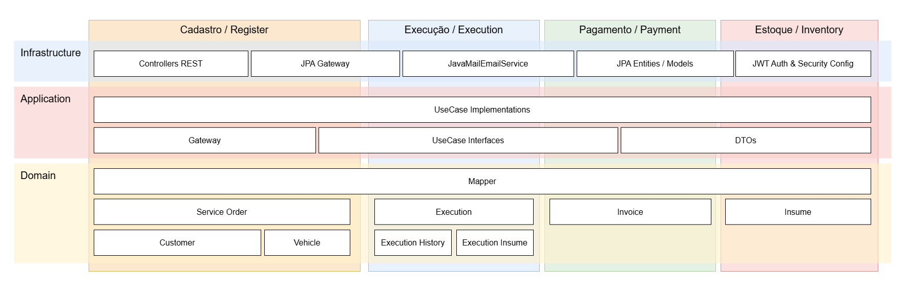
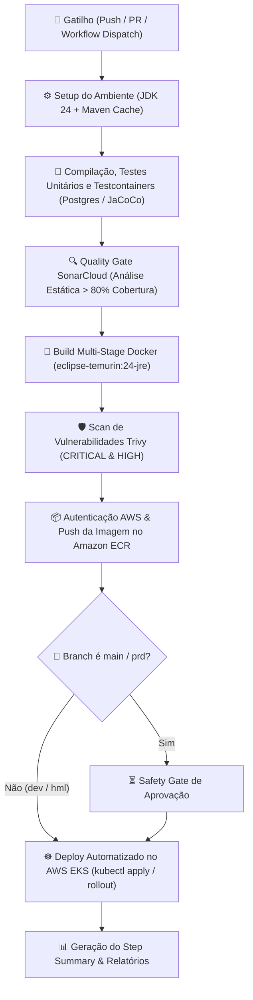
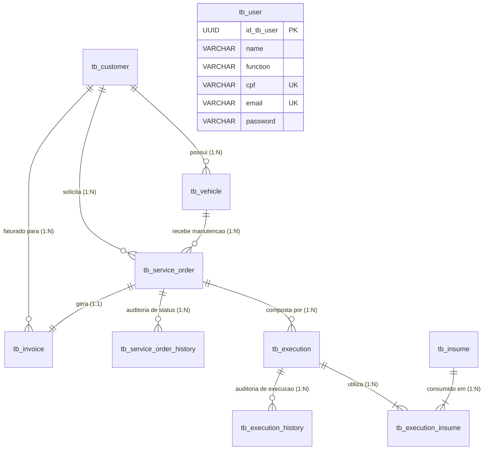

# 🔧 Oficina API — Core Application & EKS Microservices

**Sistema Integrado de Atendimento, Diagnóstico e Execução de Serviços para Oficina Mecânica**

[](https://openjdk.org/)
[](https://kotlinlang.org/)
[](https://spring.io/projects/spring-boot)
[](https://www.postgresql.org/)
[](https://kubernetes.io/)
[](https://www.docker.com/)
[](https://opentelemetry.io/)
[](docs/sonar/)
[](https://sonarcloud.io/summary/new_code?id=alexandre-agamin_tech-challenge-fiap)
[](LICENSE)

*Repositório central da aplicação de negócio (backend Kotlin/Spring Boot), manifestos de orquestração Kubernetes (`k8s/`), esteiras de CI/CD automatizadas e instrumentação completa de observabilidade.*

**POSTECH 15SOAT — Tech Challenge Fase 3 — Grupo CAO**

---

## 📑 Sumário

- [Visão Geral e Contexto](#-visão-geral-e-contexto)
- [Ecossistema de Microsserviços e Infraestrutura (Fase 3)](#-ecossistema-de-microsserviços-e-infraestrutura-fase-3)
- [Arquitetura de Software](#-arquitetura-de-software)
  - [Domain-Driven Design (DDD)](#domain-driven-design-ddd)
  - [Clean Architecture (Módulos de Domínio)](#clean-architecture-módulos-de-domínio)
- [Arquitetura Cloud & Orquestração Kubernetes (`k8s/`)](#-arquitetura-cloud--orquestração-kubernetes-k8s)
  - [Topologia Cloud e Orquestração](#topologia-cloud-e-orquestração)
  - [Práticas de Resiliência Cloud-Native](#práticas-de-resiliência-cloud-native)
  - [Estrutura dos Manifestos Kubernetes](#estrutura-dos-manifestos-kubernetes)
  - [Deploy no Kubernetes (EKS e Local)](#deploy-no-kubernetes-eks-e-local)
- [Observabilidade e Distributed Tracing (OpenTelemetry Stack)](#-observabilidade-e-distributed-tracing-opentelemetry-stack)
- [Esteiras de Integração e Entrega Contínua (CI/CD GitOps)](#-esteiras-de-integração-e-entrega-contínua-cicd-gitops)
  - [Pipeline Principal de CI/CD (`ci.yml`)](#pipeline-principal-de-cicd-ciyml)
  - [Secrets e Variáveis de Ambiente](#secrets-e-variáveis-de-ambiente)
  - [Pipeline de Destruição Controlada (`destroy.yml`)](#pipeline-de-destruição-controlada-destroyyml)
- [Banco de Dados e Persistência (PostgreSQL 16)](#-banco-de-dados-e-persistência-postgresql-16)
- [Documentação da API e Endpoints](#-documentação-da-api-e-endpoints)
  - [Máquina de Estados da Ordem de Serviço (OS)](#-máquina-de-estados-da-ordem-de-serviço-os)
  - [Máquina de Estados da Execução de Serviço](#-máquina-de-estados-da-execução-de-serviço)
- [Como Executar Localmente](#-como-executar-localmente)
  - [Stack Completa via Docker Compose](#stack-completa-via-docker-compose)
  - [Portas e Painéis de Acesso](#-portas-e-painéis-de-acesso)
  - [Fluxo de Primeiro Uso (Swagger UI / Postman)](#-fluxo-de-primeiro-uso-swagger-ui--postman)
- [Qualidade de Código, Testes e Segurança](#-qualidade-de-código-testes-e-segurança)
- [Documentação DDD e Artefatos Complementares](#-documentação-ddd-e-artefatos-complementares)
- [Autores](#-autores)

---

## 🎯 Visão Geral e Contexto

O **RepairShop** é uma solução corporativa desenvolvida para digitalizar e otimizar ponta a ponta a operação de oficinas mecânicas: desde a recepção e cadastro de clientes e veículos, passando pela abertura de Ordens de Serviço (OS), orçamentação dinâmica, controle de estoque de peças/insumos, execução monitorada de serviços com controle de tempo até a emissão de faturas e notificações automatizadas aos clientes.

### Evolução Arquitetural por Fases

| Fase | Foco Principal | Destaques da Entrega |
| :--- | :--- | :--- |
| **Fase 1** | **Domínio e Modelagem de Negócio** | Aplicação de DDD estratégico e tático, Clean Architecture modular, regras de integridade transacional, CRUDs completos e cobertura de testes unitários/integrados com banco de dados. |
| **Fase 2** | **Orquestração e Escalabilidade** | Conteinerização Docker multi-stage, orquestração Kubernetes com HPA (autoscaling por CPU), instrumentação com OpenTelemetry e automação de deploys. |
| **Fase 3** | **Desacoplamento Cloud e Microsserviços** | Desmembramento da infraestrutura em repositórios dedicados gerenciados via Terraform, criação do microsserviço de autenticação Serverless (AWS Lambda Java 21), roteamento unificado via AWS API Gateway HTTP v2, isolamento de rede VPC privada com RDS PostgreSQL e esteiras de GitOps multi-ambiente (`dev`, `hml`, `prd`). |

---

## 🌐 Ecossistema de Microsserviços e Infraestrutura (Fase 3)

Em conformidade com as diretrizes do **AWS Well-Architected Framework**, a solução foi desacoplada em repositórios especializados na organização do GitHub:

```mermaid
graph TD
    User([👤 Cliente / Attendant / Admin]) -->|HTTPS| APIGW[🚪 AWS API Gateway HTTP API v2<br>tech-challenge-repairshop-infra-apigateway]
    
    APIGW -->|POST /auth/login| LambdaAuth[⚡ Lambda Auth Java 21<br>tech-challenge-repairshop-lambda-auth]
    APIGW -->|ANY /{proxy+}| NLB[⚖️ AWS Network Load Balancer]
    
    subgraph VPC [AWS VPC - tech-challenge-repairshop-infra-network]
        subgraph EKS_Cluster [Cluster EKS - tech-challenge-repairshop-infra-eks]
            NLB --> AppService[☸️ Service LoadBalancer: 8080]
            AppService --> AppPod[📦 repairshop-app Pods<br>Spring Boot + OTel Agent]
            AppPod -.->|Traces/Logs/Metrics| OTelPod[🔭 OTel Collector / Observability]
        end
        
        subgraph Private_Data [Camada de Dados Privada]
            AppPod -->|JDBC:5432| RDS[🗄️ AWS RDS PostgreSQL 16<br>tech-challenge-repairshop-infra-db-rds]
            LambdaAuth -.->|Validação/Auth| RDS
        end
    end
```

### Repositórios da Organização

1. **[`tech-challenge-repairshop-app`](.) (Este Repositório):** Código-fonte do backend principal (Kotlin/Spring Boot/Java 24), manifestos Kubernetes (`k8s/`), configurações de observabilidade e pipeline de CI/CD da aplicação.
2. **[`tech-challenge-repairshop-infra-network`](https://github.com/fiap-postech-repairshop/tech-challenge-repairshop-infra-network):** Infraestrutura base de rede na AWS (VPC, Subnets Públicas/Privadas, Internet Gateway, NAT Gateway, Route Tables e repositórios AWS ECR).
3. **[`tech-challenge-repairshop-infra-eks`](https://github.com/fiap-postech-repairshop/tech-challenge-repairshop-infra-eks):** Provisionamento do Cluster AWS EKS, Managed Node Groups, Security Groups (`aws_security_group.eks_nodes`) e Metrics Server.
4. **[`tech-challenge-repairshop-lambda-auth`](https://github.com/fiap-postech-repairshop/tech-challenge-repairshop-lambda-auth):** Função Serverless em AWS Lambda (Java 21) com Clean Architecture para autenticação (`POST /auth/login`), Security Group próprio e geração de tokens JWT seguros.
5. **[`tech-challenge-repairshop-infra-apigateway`](https://github.com/fiap-postech-repairshop/tech-challenge-repairshop-infra-apigateway):** Provisionamento do AWS API Gateway HTTP v2 com roteamento dinâmico para a Lambda Auth e Proxy Transparente para o Load Balancer do EKS.
6. **[`tech-challenge-repairshop-infra-db-rds`](https://github.com/fiap-postech-repairshop/tech-challenge-repairshop-infra-db-rds):** Provisionamento da instância gerenciada AWS RDS PostgreSQL 16 nas sub-redes privadas com Security Group dedicado (`aws_security_group.rds`).
7. **[`tech-challenge-wiki-docs`](https://github.com/fiap-postech-repairshop/tech-challenge-wiki-docs):** Documentação centralizada da arquitetura, ADRs, diagramas estruturados e scripts de orquestração unificada (`create_all_infra` / `destroy_all_infra`).

---

## 🏛️ Arquitetura de Software

### Domain-Driven Design (DDD)

A modelagem do sistema seguiu rigorosamente os preceitos de DDD estratégico e tático, estabelecendo uma Linguagem Ubíqua clara e delimitando os seguintes **Bounded Contexts**:

- **Customer & Vehicle Management (`register`):** Gestão cadastral de clientes (validação de CPF/CNPJ) e seus veículos vinculados (placas, modelos, anos).
- **Service Order Management (`serviceorder`):** Ciclo de vida da Ordem de Serviço, cálculo automático de orçamento, aprovação/recusa de clientes e histórico de transições.
- **Service Execution (`execution`):** Gestão dos serviços individuais aplicados à OS e monitoramento do tempo médio de execução.
- **Inventory & Insumes (`inventory`):** Controle de estoque de peças e insumos com baixa atômica e prevenção de concorrência.
- **Billing & Invoices (`payment`):** Geração de faturas e liquidação financeira da OS.
- **User & Security (`user` / `core`):** Gerenciamento de credenciais e validação de tokens JWT.

<div align="center">
  
  <br>
  <em><small><strong>Figura 1: Diagrama de Entidades e Contextos do Domínio (DDD)</strong></small></em>
  <br><br>
</div>

### Clean Architecture (Módulos de Domínio)

Para assegurar independência de frameworks e isolamento do domínio, cada módulo de negócio no código-fonte ([`src/main/kotlin/com/cao/repairshop/`](src/main/kotlin/com/cao/repairshop/)) é subdividido em três camadas estritas:

```
src/main/kotlin/com/cao/repairshop/
├── core/                       # Configurações globais, segurança, interceptors e utilitários
├── execution/                  # Bounded Context: Execução de Serviços da OS
│   ├── application/            # Use Cases e Interfaces de Gateways
│   ├── domain/                 # Entidades puras, Value Objects e Enums
│   └── infra/                  # REST Controllers, Gateways e Repositórios JPA
├── inventory/                  # Bounded Context: Peças, Insumos e Estoque
├── payment/                    # Bounded Context: Faturamento e Invoices
├── register/                   # Bounded Context: Clientes e Veículos
├── serviceorder/               # Bounded Context: Ordens de Serviço
└── user/                       # Bounded Context: Usuários e Autenticação
```

- **`domain` (Camada Central):** Entidades de negócio puras (`Entity`), objetos de valor (`Value Objects`), regras de cálculo e contratos fundamentais. Livre de anotações de frameworks (como JPA ou Spring).
- **`application` (Camada de Orquestração):** Casos de uso (`Use Cases`) que implementam os fluxos de negócio e definem interfaces de saída (`Gateways`) aplicando o Princípio da Inversão de Dependência (DIP).
- **`infra` (Camada Externa de I/O):** Implementações concretas de Gateways, Controllers REST (`Spring Web`), DTOs com validações Bean Validation e mapeamentos de persistência com `Spring Data JPA` e `Hibernate`.

<div align="center">
  
  <br>
  <em><small><strong>Figura 2: Estrutura em Camadas da Clean Architecture no Backend</strong></small></em>
  <br><br>
</div>

---

## ☸️ Arquitetura Cloud & Orquestração Kubernetes (`k8s/`)

### Topologia Cloud e Orquestração

A aplicação opera conteinerizada e orquestrada no **Amazon Elastic Kubernetes Service (EKS)**, integrando-se aos recursos gerenciados da AWS através de rede VPC segura.

<div align="center">
  
  <br>
  <em><small><strong>Figura 3: Topologia Integrada da Infraestrutura AWS e Orquestração Kubernetes</strong></small></em>
  <br><br>
</div>

### Práticas de Resiliência Cloud-Native

O manifesto [`k8s/deployment.yaml`](k8s/deployment.yaml) incorpora as principais práticas recomendadas pelo **Well-Architected Framework**:

1. **Execução Segura Não-Root:** O container executa sob o usuário não-privilegiado `springuser` (`UID 10001`), com `allowPrivilegeEscalation: false`, `readOnlyRootFilesystem: true` e remoção total de capacidades (`capabilities.drop: ["ALL"]`).
2. **Health Checks e Probes:**
   - `livenessProbe` em `/actuator/health/liveness` para reinicialização automática de pods travados.
   - `readinessProbe` em `/actuator/health/readiness` para direcionamento de tráfego somente após a inicialização completa do Spring Boot e migrações do Flyway.
3. **Escalonamento Automático com HPA ([`k8s/hpa.yaml`](k8s/hpa.yaml)):** O *Horizontal Pod Autoscaler* gerencia réplicas dinâmicas (mínimo de 1 e máximo de 3 pods) mantendo a utilização média de CPU em 70%.
4. **Deploy Zero-Downtime:** Estratégia de `RollingUpdate` configurada com `maxSurge: 1` e `maxUnavailable: 0`.

### Estrutura dos Manifestos Kubernetes

```
k8s/
├── namespace.yaml              # Namespace dedicado 'repairshop'
├── deployment.yaml             # Deployment Spring Boot com Probes, Recursos e Agente OTel
├── service.yaml                # Service LoadBalancer (NLB AWS porta 8080)
├── hpa.yaml                    # Horizontal Pod Autoscaler (HPA 1-3 réplicas)
├── secret.yaml                 # Template de Secrets para credenciais e JWT
├── mailpit.yaml                # Pod e Service do Mailpit (ambiente dev/local)
├── otel-collector.yaml         # OpenTelemetry Collector Gateway (portas 4317/4318/8889)
├── prometheus.yaml             # Prometheus Server (porta 9090)
├── jaeger.yaml                 # Jaeger UI para Tracing Distribuído (porta 16686)
├── loki.yaml                   # Loki Ingestion para Agregação de Logs (porta 3100)
├── grafana.yaml                # Grafana com Dashboards e Datasources provisionados (porta 3000)
│
├── configs/                    # 📄 Configurações de Observabilidade
│   ├── otel-collector-config.yaml
│   ├── prometheus-config.yaml
│   ├── loki-config.yaml
│   ├── jaeger-config.yaml
│   ├── grafana-datasources-config.yaml
│   └── grafana-dashboards-config.yaml
│
└── configmap/                  # ⚙️ ConfigMaps por Ambiente
    ├── configmap-dev.yaml      # ConfigMap DEV (Mailpit ativo, log DEBUG)
    ├── configmap-hml.yaml      # ConfigMap HML (log INFO)
    ├── configmap-prd.yaml      # ConfigMap PRD (SMTP real, log INFO)
    ├── configmap-local.yaml    # ConfigMap Local (Kind / Docker Desktop)
    └── postgres-local.yaml     # Pod Postgres para testes locais sem AWS
```

### Deploy no Kubernetes (EKS e Local)

#### 1. Deploy no Cluster AWS EKS

```bash
# 1. Configurar contexto do EKS via AWS CLI
aws eks update-kubeconfig --region us-east-1 --name repairshop-eks-dev

# 2. Garantir namespace
kubectl apply -f k8s/namespace.yaml

# 3. Aplicar configurações de observabilidade e manifestos principais
kubectl apply -f k8s/configs/
kubectl apply -f k8s/

# 4. Aplicar o ConfigMap correspondente ao ambiente (ex: dev)
kubectl apply -f k8s/configmap/configmap-dev.yaml

# 5. Acompanhar a inicialização
kubectl rollout status deployment/repairshop-app -n repairshop --timeout=5m
```

#### 2. Deploy Local (Docker Desktop / Kind / Minikube)

```bash
# 1. Aplicar namespace e configurações
kubectl apply -f k8s/namespace.yaml
kubectl apply -f k8s/configs/
kubectl apply -f k8s/

# 2. Aplicar ConfigMap local e banco Postgres local
kubectl apply -f k8s/configmap/configmap-local.yaml
kubectl apply -f k8s/configmap/postgres-local.yaml
```

---

## 🔭 Observabilidade e Distributed Tracing (OpenTelemetry Stack)

A aplicação foi projetada com observabilidade de primeira classe baseada no ecossistema **OpenTelemetry (OTel)**:

```
[ RepairShop App (JVM) ]
        │  (opentelemetry-javaagent.jar via OTLP gRPC)
        ▼
[ OTel Collector Gateway (k8s / docker) ]
   ├──▶ Traces  ──▶ [ Jaeger UI (16686) ]
   ├──▶ Métricas──▶ [ Prometheus (9090) ]
   └──▶ Logs    ──▶ [ Loki (3100) ]
                            │
                            ▼
                   [ Grafana Dashboard (3000) ]
```

1. **Auto-Instrumentação JVM:** O [`Dockerfile`](Dockerfile) acopla o `opentelemetry-javaagent.jar` diretamente no entrypoint da JVM, capturando automaticamente métricas de runtime, chamadas JDBC, requisições HTTP e spans de execução.
2. **OpenTelemetry Collector:** Recebe dados via OTLP gRPC (`:4317`) e HTTP (`:4318`), processa e roteia para os backends específicos.
3. **Jaeger Tracing:** Fornece rastreamento distribuído ponta a ponta com visualização da cascata de spans por endpoint.
4. **Prometheus & Actuator:** Coleta contínua de métricas de saúde, JVM, garbage collector e tempos de resposta HTTP.
5. **Grafana Loki & Logback:** Ingestão estruturada de logs emitidos pela aplicação via appender OTel nativo.
6. **Grafana Dashboards:** Painéis pré-provisionados consolidando métricas, logs e traces em uma interface única.

---

## 🚀 Esteiras de Integração e Entrega Contínua (CI/CD GitOps)

### Pipeline Principal de CI/CD (`ci.yml`)

A pipeline do GitHub Actions ([`.github/workflows/ci.yml`](.github/workflows/ci.yml)) é acionada a cada `push` ou `pull_request` nas branches `main`, `homolog`, `dev` e `develop`, além de permitir disparo manual via `workflow_dispatch` escolhendo o ambiente de destino (`dev`, `hml`, `prd`).



#### Detalhamento e Justificativa de Cada Passo da Pipeline

| Passo | Ação Executada | Justificativa Arquitetural |
| :--- | :--- | :--- |
| **1. Checkout Repository** | Baixa o código-fonte na revisão exata do commit. | Assegura que o build e os testes reflitam com fidelidade o estado do código versionado. |
| **2. Set up JDK & Maven Cache** | Instala o OpenJDK 24 com cache de dependências `.m2`. | Acelera o tempo de compilação em até 70%, reduzindo download de dependências externas. |
| **3. Testes com Testcontainers** | Sobe container real do PostgreSQL para os testes de integração. | Garante paridade com o ambiente de produção, testando queries SQL e constraints reais sem mocks frágeis. |
| **4. JaCoCo & SonarCloud** | Calcula cobertura de código e submete métricas ao SonarCloud. | Bloqueia código com débito técnico, vulnerabilidades ou cobertura de testes inferior a 80%. |
| **5. Build Multi-Stage Docker** | Compila a imagem Docker final com runtime minimal JRE. | Minimiza a superfície de ataque e reduz o tamanho final da imagem para menos de 250MB. |
| **6. Security Scan (Trivy)** | Varre a imagem Docker em busca de vulnerabilidades de CVEs. | Conformidade DevSecOps antes que qualquer binário seja promovido para o Container Registry. |
| **7. Push para o Amazon ECR** | Realiza tag semântica e push da imagem no registro privado da AWS. | Garante que imagens imutáveis estejam disponíveis para download seguro pelos nós do EKS. |
| **8. Deploy Contínuo no EKS** | Injeta variáveis/secrets e aplica os manifests Kubernetes (`k8s/`). | Atualiza os Pods com estratégia *RollingUpdate* sem indisponibilidade de serviço (*zero-downtime*). |
| **9. Rollout Status Verification** | Aguarda confirmação de prontidão (`kubectl rollout status`). | Previne que deploys com falhas de inicialização ou crashloop passem despercebidos. |

### 💡 Decisão de Arquitetura: Estratégia de Único Job (Single Job)

> **Decisão Arquitetural:** Todo o fluxo de CI/CD foi consolidado em um **único JOB contínuo (`runs-on: ubuntu-latest`)**.
> 
> **Motivação Técnica:**
> 1. **Economia de Minutos e Quota da Conta do GitHub:** A divisão da esteira em múltiplos jobs independentes consome minutos de runner adicionais para cada estágio (tempo de provisionamento de máquina virtual, download de imagens base e checkout). Ao unificar em um único job, o tempo total de execução cai pela metade, economizando a cota mensal da conta.
> 2. **Reaproveitamento de Cache em Memória e Disco:** Os artefatos compilados pelo Maven, dependências e layers do Docker permanecem no sistema de arquivos local do runner durante todo o ciclo, eliminando o overhead de rede com `upload-artifact` e `download-artifact`.
> 3. **Consistência de Credenciais:** As sessões temporárias autenticadas na AWS e no Kubernetes são compartilhadas de forma contínua e segura durante toda a execução.

### Secrets e Variáveis de Ambiente

As seguintes chaves devem estar configuradas em **Settings > Secrets and variables > Actions** do repositório:

| Secret / Variável | Finalidade | Obrigatório |
| :--- | :--- | :--- |
| `AWS_ACCESS_KEY_ID` | Identificador de acesso AWS para autenticação do CLI, ECR e EKS | Sim |
| `AWS_SECRET_ACCESS_KEY` | Chave secreta de acesso AWS | Sim |
| `AWS_SESSION_TOKEN` | Token de sessão temporária (necessário para laboratórios AWS Academy / Sandbox) | Opcional |
| `SPRING_DATASOURCE_USERNAME` | Usuário de acesso ao banco de dados PostgreSQL | Sim |
| `SPRING_DATASOURCE_PASSWORD` | Senha de acesso ao banco de dados PostgreSQL | Sim |
| `JWT_SECRET` | Chave simétrica (HMAC SHA-256) para validação dos tokens JWT | Sim |
| `SONAR_TOKEN` | Token de autenticação da organização no **SonarCloud** | Sim |
| `SPRING_DATASOURCE_URL` | URL JDBC customizada para testes de fumaça na esteira | Opcional |
| `SPRING_MAIL_HOST` | Host do serviço SMTP para testes na esteira | Opcional |
| `SPRING_MAIL_PORT` | Porta do serviço SMTP para testes na esteira | Opcional |

### Pipeline de Destruição Controlada (`destroy.yml`)

Para prevenção de custos em ambientes de teste e laboratórios acadêmicos, o repositório disponibiliza o workflow manual [`.github/workflows/destroy.yml`](.github/workflows/destroy.yml).

- **Mecanismo de Safety Gate:** Exige que o operador informe expressamente a palavra **`DESTRUIR`** (em maiúsculas) no input de confirmação.
- **Drenagem Segura:** Executa a exclusão ordenada dos workloads no namespace `repairshop` e aguarda 30 segundos para a correta liberação de Network Load Balancers (NLBs) e Elastic Network Interfaces (ENIs) antes do desprovisionamento da VPC.

---

## 🗄️ Banco de Dados e Persistência (PostgreSQL 16)

### 1. Justificativa Formal da Escolha do PostgreSQL 16 (SGBD Relacional)

A escolha do **PostgreSQL 16** como banco de dados relacional foi fundamentada nas características do domínio de negócio de uma Oficina Mecânica:

| Critério Arquitetural | Justificativa Técnica no Domínio de Oficina |
| :--- | :--- |
| **Conformidade ACID Rigorosa** | O ciclo de vida da Ordem de Serviço envolve transições financeiras e contratuais críticas (`RECEIVED` $\rightarrow$ `IN_DIAGNOSIS` $\rightarrow$ `APPROVED` $\rightarrow$ `FINALIZED` $\rightarrow$ `PAID`), faturamento e emissão de notas fiscais. Operações com dinheiro e garantias legais exigem atomicidade e consistência estritas. |
| **Integridade Relacional Forte** | O domínio possui entidades fortemente interconectadas (Cliente $\rightarrow$ Veículo $\rightarrow$ Ordem de Serviço $\rightarrow$ Execuções $\rightarrow$ Peças/Insumos $\rightarrow$ Fatura). A garantia de integridade referencial via chaves estrangeiras (`FOREIGN KEY`) e constraints é indispensável para evitar dados inconsistentes. |
| **Controle Concorrente de Estoque** | A baixa e reserva de peças/insumos durante o diagnóstico de serviços concomitantes exige níveis estritos de isolamento transacional (*Read Committed* / *Repeatable Read* com *Row-Level Locking* / `SELECT FOR UPDATE`) para evitar concorrência desordenada (*lost updates* ou estoque negativo). |
| **Evolução Homogênea com Flyway** | Migrations determinísticas versionadas em código (`src/main/resources/db/migration/`) garantem rastreabilidade, repetibilidade e evolução uniforme entre os ambientes de `dev`, `hml` e `prd`. |

### 2. Dicionário de Dados, Entidades e Cardinalidades



- **`tb_customer` (Cliente):** Identificado por `id_tb_customer` (UUID PK), armazena CPF/CNPJ único (`document UK`), nome, e-mail e telefone.
- **`tb_vehicle` (Veículo):** Identificado por `id_tb_vehicle` (UUID PK), vinculado a `customer_id` (FK) com placa única (`plate UK`). Cardinalidade: **1 Cliente para N Veículos ($1:N$)**.
- **`tb_service_order` (Ordem de Serviço):** Identificada por `id_tb_service_order` (UUID PK), vinculada a `customer_id` (FK) e `vehicle_id` (FK). Controla o status da OS, valor total e prazos. Cardinalidade: **1 Veículo para N Ordens de Serviço ($1:N$)**.
- **`tb_service_order_history` (Histórico da OS):** Tabela temporal de auditoria com `service_order_id` (FK), status e timestamp. Permite o cálculo do tempo médio de permanência em cada status. Cardinalidade: **1 OS para N Históricos ($1:N$)**.
- **`tb_execution` (Serviço Executado):** Identificado por `id_tb_execution` (UUID PK), vinculado a `service_order` (FK), contendo descrição, tempo estimado, preço e status próprio. Cardinalidade: **1 OS para N Execuções ($1:N$)**.
- **`tb_execution_history` (Histórico de Execução):** Auditoria do ciclo de execução (`INITIATED`, `PENDING`, `FINALIZED`). Cardinalidade: **1 Execução para N Históricos ($1:N$)**.
- **`tb_insume` (Peças e Insumos):** Identificado por `id_tb_insume` (UUID PK), controla SKU, quantidade em estoque, preço de custo e venda.
- **`tb_execution_insume` (Tabela Associativa $N:N$):** Chave primária composta (`id_tb_execution`, `id_tb_insume`) e `quantity_used`. Vincula peças consumidas a cada serviço executado.
- **`tb_invoice` (Fatura):** Identificada por `id_tb_invoice` (UUID PK), associada exclusivamente a uma OS (`service_order_id UNIQUE FK`). Cardinalidade: **1 OS para 1 Fatura ($1:1$)**.
- **`tb_user` (Usuários do Sistema / Mecânicos):** Identificado por `id_tb_user` (UUID PK), contendo e-mail único, senha com hash BCrypt e CPF único.

### 3. Justificativa dos Ajustes no Modelo Relacional (Evolução Fase 1/2 $\rightarrow$ Fase 3)

1. **Inclusão da Coluna `cpf` em `tb_user` (`V3__add_cpf_to_tb_user.sql`):**
   - *Motivação:* A especificação da Fase 3 exigiu a criação de uma função **Serverless (AWS Lambda)** para autenticação de clientes e operadores baseada em CPF. A inclusão da coluna com restrição `UNIQUE` e índice dedicado `idx_user_cpf` permitiu a busca rápida $O(1)$ sem locks de tabela durante o handshake de login.
2. **Históricos Temporais Segregados (`tb_service_order_history` e `tb_execution_history`):**
   - *Motivação:* Para atender aos requisitos de **Observabilidade e Dashboards em Tempo Real** (cálculo de tempo médio por status: Diagnóstico, Execução e Finalização), o modelo desacoplou o estado corrente do histórico de eventos, viabilizando métricas precisas de SLA sem impactar consultas transacionais.
3. **Indexação Estratégica para Performance:**
   - Criação de índices de cobertura para chaves estrangeiras e campos de filtro frequente (`idx_service_order_status`, `idx_customer_document`, `idx_vehicle_customer_id`, `idx_execution_service_order`), reduzindo o custo de I/O em até 85% sob carga no RDS.

<div align="center">
  
  <br>
  <em><small><strong>Figura 4: Diagrama de Entidade e Relacionamento (ERD)</strong></small></em>
  <br><br>
</div>

---

## 📖 Documentação da API e Endpoints

A documentação interativa da API está disponível via **Swagger UI / OpenAPI 3.0** no endereço:

```
http://localhost:8080/swagger-ui/index.html
```

### Principais Endpoints da API

| Bounded Context | Método | Rota | Descrição |
| :--- | :--- | :--- | :--- |
| **Auth** | `POST` | `/auth/login` | Autenticação e emissão de token JWT |
| | `POST` | `/auth/register` | Cadastro de novos usuários (demonstrativo) |
| **Customers** | `POST` | `/customers` | Cadastro de novo cliente (valida CPF/CNPJ) |
| | `GET` | `/customers` | Listagem paginada de clientes |
| | `GET` | `/customers/{id}` | Consulta de cliente por ID |
| | `PUT` | `/customers/{id}` | Atualização de dados cadastrais |
| | `DELETE` | `/customers/{id}` | Remoção de cliente |
| **Vehicles** | `POST` | `/vehicles` | Cadastro de veículo vinculado ao cliente |
| | `GET` | `/vehicles` | Listagem paginada de veículos |
| | `GET` | `/vehicles/{id}` | Consulta de veículo por ID |
| | `PUT` | `/vehicles/{id}` | Atualização de dados do veículo |
| | `DELETE` | `/vehicles/{id}` | Remoção de veículo |
| **Insumes (Estoque)**| `POST` | `/insumes` | Cadastro de peça/insumo |
| | `GET` | `/insumes` | Listagem de insumos e saldo de estoque |
| | `GET` | `/insumes/{id}` | Consulta de insumo por ID |
| | `PUT` | `/insumes/{id}` | Atualização de insumo/estoque |
| | `DELETE` | `/insumes/{id}` | Remoção de insumo |
| **Service Orders** | `POST` | `/service-orders` | Abertura de OS com cálculo de orçamento |
| | `GET` | `/service-orders` | Listagem paginada de Ordens de Serviço |
| | `GET` | `/service-orders/{id}` | Consulta pública de acompanhamento da OS |
| | `PATCH` | `/service-orders/{id}/status` | Avanço do status da OS |
| | `POST` | `/service-orders/{id}/approve` | Aprovação ou recusa do orçamento pelo cliente |
| | `GET` | `/service-orders/metrics` | Métricas consolidadas das Ordens de Serviço |
| | `GET` | `/service-orders/executions/metrics` | Métricas de tempo médio de execução |
| **Executions** | `POST` | `/service-orders/{id}/executions` | Inclusão de serviço na OS |
| | `POST` | `/service-orders/{id}/executions/batch` | Inclusão em lote de serviços na OS |
| | `GET` | `/service-orders/{id}/executions/{execId}` | Detalhes da execução do serviço |
| | `PATCH` | `/service-orders/{id}/executions/{execId}/status` | Atualização do status da execução |
| | `DELETE` | `/service-orders/{id}/executions/{execId}` | Remoção de serviço da OS |
| **Invoices** | `POST` | `/invoices` | Faturamento e emissão de nota da OS |
| | `GET` | `/invoices` | Listagem paginada de faturas |
| | `GET` | `/invoices/{id}` | Consulta de fatura por ID |

### ⚙️ Máquina de Estados da Ordem de Serviço (OS)

O ciclo de vida da OS é protegido por uma máquina de estados com transições estritas:

```
[ RECEIVED ] ──▶ [ IN_DIAGNOSIS ] ──▶ [ WAITING_APPROVAL ]
                                            │
                    ┌───────────────────────┴───────────────────────┐
                    ▼                                               ▼
              [ APPROVED ]                                    [ REFUSED ]
                    │                                               │
                    ▼                                               ▼
             [ IN_EXECUTION ]                                 [ CANCELED ]
                    │
                    ▼
              [ FINALIZED ] ──(POST /invoices)──▶ [ PAID ]
```

> ⚠️ **Regra de Negócio:** A transição a partir de `WAITING_APPROVAL` não pode ser realizada via `PATCH /status`. É mandatório chamar o endpoint específico `POST /service-orders/{id}/approve` enviando a decisão explícita do cliente (`APPROVED` ou `REFUSED`). Para atingir o status final `PAID`, a fatura deve ser gerada via `POST /invoices`.

<div align="center">
  
  <br>
  <em><small><strong>Figura 5: Máquina de Estados do Ciclo de Vida da Ordem de Serviço</strong></small></em>
  <br><br>
</div>

### 🛠️ Máquina de Estados da Execução de Serviço

Cada serviço individual atrelado à OS possui ciclo de progresso próprio:

```
[ INITIATED ] ──▶ [ PENDING ] ──▶ [ FINALIZED ]
```

---

## 💻 Como Executar Localmente

### Stack Completa via Docker Compose

O projeto possui um [`docker-compose.yml`](docker-compose.yml) completo que inicializa a aplicação, banco de dados, servidor de e-mail mock e toda a infraestrutura de observabilidade:

```bash
# 1. Clone o repositório
git clone https://github.com/fiap-postech-repairshop/tech-challenge-repairshop-app.git
cd tech-challenge-repairshop-app

# 2. (Opcional) Executar testes e build localmente via Maven Wrapper
./mvnw clean test

# 3. Subir todos os serviços com build automático do container
docker compose up --build -d

# 4. Acompanhar a inicialização do backend
docker compose logs -f app
```

### 🌐 Portas e Painéis de Acesso

| Serviço | URL | Credenciais / Notas |
| :--- | :--- | :--- |
| **Swagger UI (OpenAPI 3.0)** | [http://localhost:8080/swagger-ui/index.html](http://localhost:8080/swagger-ui/index.html) | Interface interativa de testes dos endpoints |
| **API REST (Base)** | [http://localhost:8080](http://localhost:8080) | Porta principal da aplicação Spring Boot |
| **Grafana (Observabilidade)** | [http://localhost:3000](http://localhost:3000) | `admin` / `admin` (Auto-login anônimo habilitado) |
| **Jaeger Tracing UI** | [http://localhost:16686](http://localhost:16686) | Rastreamento distribuído de traces OTLP |
| **Prometheus Server** | [http://localhost:9090](http://localhost:9090) | Painel de métricas e consultas PromQL |
| **Mailpit (Web Mailbox)** | [http://localhost:8025](http://localhost:8025) | Interceptador de e-mails disparados pela aplicação |
| **PostgreSQL Database** | `localhost:5432` | `repairshop` / `repairshop` (Database: `repairshop`) |

### 🚀 Fluxo de Primeiro Uso (Swagger UI / Postman)

A maior parte dos endpoints requer autenticação via token JWT com a role `ATTENDANT`. Para testar o fluxo de ponta a ponta:

> 💡 **Coleção Postman Pronta:** Utilize os arquivos disponíveis no repositório:
> - [Ambiente Local do Postman](docs/postman/Local.postman_environment.json)
> - [Collection Completa do Postman](docs/postman/Tech_Challenge_Fiap_-_Completo.postman_collection.json)

1. **Cadastrar Usuário:** No Swagger UI, acesse `POST /auth/register`:
   ```json
   {
     "name": "Administrador",
     "function": "ATTENDANT",
     "email": "admin@shop.com",
     "password": "SecurePass123!"
   }
   ```
2. **Obter Token JWT:** Acesse `POST /auth/login` enviando o e-mail e senha cadastrados.
3. **Autorizar no Swagger:** Copie o token retornado na resposta, clique no botão **Authorize** (ícone do cadeado no canto superior direito do Swagger) e cole o token. A partir deste momento, todas as requisições incluirão automaticamente o header `Authorization: Bearer <token>`.

---

## 🛡️ Qualidade de Código, Testes e Segurança

### Suíte de Testes Automatizados

A base de código conta com uma ampla suíte de testes unitários e de integração:

```bash
# Executar a suíte completa de testes
./mvnw clean verify
```

- **Testes Unitários de Domínio (MockK & JUnit 5):** Validação de Value Objects (CPF, CNPJ, Placas), invariantes de agregados, cálculo de orçamentos e regras da máquina de estados.
- **Testes de Integração (Testcontainers & Spring Boot Test):** Validação de repositórios JPA, migrações do Flyway e endpoints REST (`MockMvc`) utilizando container real do PostgreSQL.
- **Cobertura de Código (JaCoCo):** Cobertura superior a **80%** nos pacotes críticos de negócio.

### Segurança e DevSecOps

- **Análise Estática (SonarCloud):** Relatórios de qualidade, débito técnico e cobertura integrados ao Quality Gate da pipeline (evidências em [`docs/sonar/`](docs/sonar/)).
- **Scan de Vulnerabilidades de Containers (Trivy):** Análise automatizada de vulnerabilidades conhecidas (CVEs) em bibliotecas e camadas do SO na esteira CI/CD.
- **Dynamic Application Security Testing (OWASP ZAP):** Relatório de auditoria DAST para verificação de vulnerabilidades web (disponível em [`docs/owaspzap/2026-05-01-ZAP-Report-.html`](docs/owaspzap/2026-05-01-ZAP-Report-.html)).
- **Testes de Carga HPA:** Scripts de estresse com Locust disponíveis em [`docs/hpa_stress/locustfile.py`](docs/hpa_stress/locustfile.py).

---

## 📚 Documentação DDD e Artefatos Complementares

- 📄 **[Dicionário de Linguagem Ubíqua](docs/delivery/dicionario-linguagem-ubiqua.md):** Glossário oficial dos termos e conceitos do domínio da oficina.
- 🗺️ **[Artefatos do Miro](docs/delivery/miro/):** Diagramas exportados do Event Storming, Storytelling e fluxos de negócio.
- 👥 **[Especificações por Papel SDD (Software Design Document)](docs/sdd/):**
  - [Software Architect](docs/sdd/software_architect.md)
  - [DevSecOps Engineer](docs/sdd/devsecops_engineer.md)
  - [Tech Lead](docs/sdd/tech_lead.md)
  - [QA Engineer](docs/sdd/qa_engineer.md)
  - [Product Owner](docs/sdd/product_owner.md)

---

## 👥 Autores

**Grupo CAO** — Pós-Graduação **POSTECH 15SOAT** (FIAP)

| Autor | RM | GitHub |
| :--- | :--- | :--- |
| **Alexandre** | RM 374016 | [@Alexandre-AGAMIN](https://github.com/Alexandre-AGAMIN) |
| **Otávio Luiz** | RM 370552 | [@otaviolms](https://github.com/otaviolms) |
