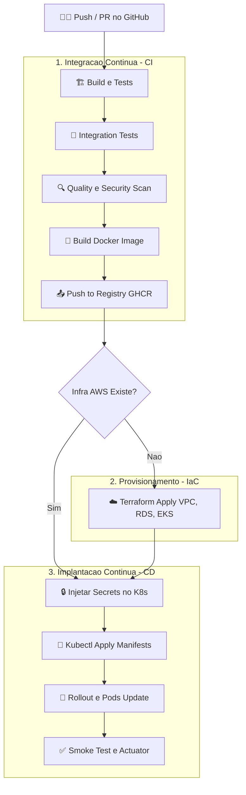

# Plano de Implantação e Arquitetura CI/CD

Este documento descreve a abordagem recomendada, do ponto de vista de arquitetura de software e DevOps, para a implantação da aplicação, recursos da nuvem, gerenciamento de banco de dados e segredos (secrets).

---

## 1. Implantação dos Recursos (IaC) vs Aplicação (CI/CD)

A melhor prática é separar o **Provisionamento da Infraestrutura** (Terraform) do **Deployment da Aplicação** (Kubernetes/CI-CD).
- **Infraestrutura Base (AWS):** A criação de rede (VPC), bancos de dados (RDS) e o cluster (EKS) devem ser gerenciados pelo Terraform. Isso muda com pouca frequência.
- **Aplicação (K8s):** A atualização da versão da aplicação (Deployments, Services, Ingress) deve ser acionada rapidamente pela pipeline de CI/CD (GitHub Actions) a cada novo push no código-fonte, utilizando ferramentas nativas (ex: `kubectl apply`, Helm, ou ArgoCD) em vez de executar o Terraform toda vez que uma nova imagem Docker for gerada.

## 2. Aplicação, Banco de Dados e Mailpit

- **A Aplicação:** Roda de forma "stateless" (sem estado) em pods escaláveis (Deployment/HPA) dentro do EKS.
- **O Banco de Dados (RDS):** A abordagem mais sólida para produção é utilizar um banco de dados gerenciado (como o AWS RDS PostgreSQL) **fora** do cluster Kubernetes. Isso tira a complexidade de gerenciar volumes persistentes (PVCs) em clusters, além de fornecer backups automatizados nativamente e alta disponibilidade (Multi-AZ). A aplicação no EKS simplesmente se conecta ao endpoint do RDS via rede interna da VPC.
- **O Mailpit:** É uma ferramenta fantástica para desenvolvimento e testes automatizados. Na pipeline de CI (durante os testes de integração e smoke tests), ele sobe via Docker Compose. Em produção, ele não deve ser instalado. A aplicação em produção no cluster deve se conectar a um serviço real de SMTP (como AWS SES, SendGrid, etc).

**Organização dos Manifestos do Repositório:**
Para suportar essa separação em produção, os arquivos Kubernetes na raiz do diretório foram organizados de modo a implantar apenas a aplicação stateless:
- **[k8s/](file:///c:/Users/Alexandre-AGAMIN/Projetos-%20FIAP/repairshop-fiap/tech-challenge-FIAP/k8s/):** Contém a aplicação e suas regras (Deployment, Service e HPA) que serão aplicadas no cluster EKS pela pipeline de CD. O banco de dados PostgreSQL não é provisionado aqui (ficando a cargo do RDS AWS via Terraform).
- **[k8s/local/](file:///c:/Users/Alexandre-AGAMIN/Projetos-%20FIAP/repairshop-fiap/tech-challenge-FIAP/k8s/local/):** Armazena os manifestos locais (ConfigMap, Secret e o banco de dados PostgreSQL interno) que servem apenas para simular e rodar o banco de dados em um cluster Kubernetes local (como Minikube ou Docker Desktop).

---

## 3. Gestão de Secrets (Senhas do BD)

> [!CAUTION]
> **NUNCA** coloque senhas, tokens ou dados confidenciais em um `ConfigMap` ou fixos no repositório. ConfigMaps são feitos para configurações não confidenciais e são armazenados em texto claro/Base64 legível.

**A Melhor Abordagem:**
1. Armazene a senha do banco de dados e as chaves de API no **GitHub Secrets** (ex: `SPRING_DATASOURCE_PASSWORD`).
2. Durante o estágio de **Deploy** da Pipeline CI/CD, a Action do Github lê esse segredo de forma segura e o injeta diretamente no cluster gerando um objeto `Secret` do Kubernetes (`kubectl create secret generic...`).
3. O Deployment da aplicação no K8s lê esse `Secret` (usando `envFrom` com `secretRef`) e o injeta na aplicação em tempo de execução como variável de ambiente. 

---

## 4. Gerenciamento de Estado do Terraform (tfstate & Backend S3)

Para evitar perda de dados, concorrência e garantir a integridade da infraestrutura gerenciada pelo Terraform:
- **Armazenamento Remoto (Amazon S3):** O arquivo `terraform.tfstate` é salvo remotamente em um bucket S3 privado, criptografado e com versionamento ativo. Isso garante que a pipeline de CI/CD e os desenvolvedores usem a mesma origem da verdade.
- **Bloqueio de Concorrência (DynamoDB):** Uma tabela do DynamoDB é utilizada para travar o estado (`State Locking`) sempre que uma operação de escrita (`apply` ou `destroy`) estiver em execução, impedindo alterações simultâneas que possam corromper os recursos.

A configuração correspondente foi isolada e implementada em arquivos dedicados do Terraform:
- **[backend.tf](file:///c:/Users/Alexandre-AGAMIN/Projetos-%20FIAP/repairshop-fiap/tech-challenge-FIAP/infra/terraform/cloud/backend.tf):** Gerencia a localização do armazenamento remoto e o controle de trava concorrente.
- **[providers.tf](file:///c:/Users/Alexandre-AGAMIN/Projetos-%20FIAP/repairshop-fiap/tech-challenge-FIAP/infra/terraform/cloud/providers.tf):** Configura as definições de provedores (`aws` e `kubernetes`) e versões requeridas.

Abaixo, a definição de estado remoto (`backend.tf`):
```hcl
terraform {
  backend "s3" {
    bucket  = "fiap-repairshop"
    key     = "terraform-config/tfstate/terraform.tfstate"
    region  = "us-east-1"
    encrypt = true
  }
}
```

---

## 5. Ordem dos Acontecimentos (Fluxo da Pipeline)

O diagrama de grafos abaixo ilustra a esteira de entrega ponta a ponta (CI/CD) com a segregação de responsabilidades.




### Resumo Cronológico:
1. **Push:** Código chega no repositório GitHub.
2. **Test & Quality (CI):** A pipeline compila, roda os testes locais e levanta instâncias temporárias de Postgres e Mailpit (via docker-compose) para garantir a saúde do software. Análises estáticas de segurança e código limpo (Sonar, Trivy) bloqueiam se houver vulnerabilidades.
3. **Containerização (CI):** Imagem final Docker é construída e empurrada para o registro de imagens privado (**Amazon ECR**).
4. **Infraestrutura (Provisionamento IaC):** (Se for a primeira vez), executa-se o Terraform para garantir que o RDS e o EKS estejam disponíveis e com rede configurada.
5. **Autenticação & Injeção de Segredos:** A Action de Deploy do GitHub se conecta ao cluster EKS usando a role IAM. Pega as senhas do banco dos _GitHub Secrets_ e salva no K8s na forma de `Secret` do tipo opaco.
6. **Deploy no K8s (CD):** Os manifestos K8s (no formato `.yaml` puro ou via helm) da aplicação, que usam as variáveis e apontam para a nova imagem Docker e para o endpoint público do RDS, são atualizados no cluster.
7. **Post-Deploy:** Uma validação final de "Smoke Test" executa em produção para verificar se a aplicação está subindo corretamente via healthcheck.
